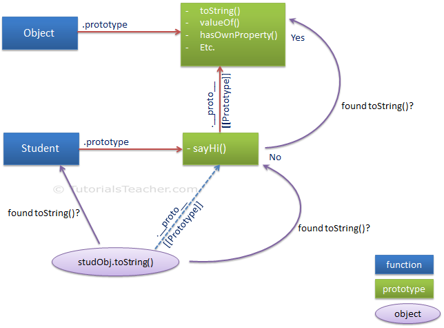

# Prototypes

> `prototype` is an attribute of all functions, and points to a map where attributes can be assigned that should be able to be accessed from all objects created with that function as the constructor. -[Javascript prototype](https://community.risingstack.com/javascript-prototype-chain-inheritance/)

## Protoype object

* Every object by default has **Object** as its prototype.

> The prototype of an object is a way to store common attributes across all instances of a class, but in a way that is overwritable. If an object doesn't have a reference to an attribute, that object's prototype will be checked for the attribute.

## Prototype chain

When a method is invoked on an object, first it is checked in that object for that method. If the method is not found, search continues in the object's prototype chain.

> Every object has a prototype, including the prototype object. This "chain" goes all the way back until it reaches an object that has no prototype, usually Object's prototype.
> personObj -> Person(constructor) -> Object



## Prototype property

> The Object.prototype is a property of the Object constructor. It is also the end of a prototype chain. - [`Object.prototype`](https://developer.mozilla.org/en-US/docs/Web/JavaScript/Reference/Global_Objects/Object/prototype)

* **Object** has a property called **prototype** which itself is an object. All those members inside this **prototype** object are inherited by objects in the prototype chain.

* Constructor functions (All javascript functions) have this **prototype** property.

```Javascript
function Person(first, last) {
  this.name = {
    first: first,
    last: last
  };
  this.greeting = function() {
    return 'Hi, I am ' + this.name.first + ' ' + this.name.last + '.';
  };
}

console.log(Person.prototype);
console.log(Person.prototype.constructor);

console.log(Object.prototype);

console.log(String.prototype);
console.log(Number.prototype);
console.log(Date.prototype);
console.log(Array.prototype);
```

* Direct members of **Object** are not inherited.

> Every object which is created using literal syntax or constructor syntax with the new keyword, includes `__proto__` property that points to prototype object of a function that created this object. - [JS prototype](https://www.tutorialsteacher.com/javascript/prototype-in-javascript)

```Javascript
//  Function's prototype property can be accessed using
//  <function-name>.prototype. However, an object (instance)
// does not expose prototype property,
// instead you can access it using __proto__.
let p1 = new Person('John', 'Doe');

// Person has a prototype property
console.log(Person.prototype);

// undefined. p1 does not have a prototype property
console.log(p1.prototype);

// p1 contains it in `__proto__`
console.log(p1.__proto__);
console.log(p1.__proto__ === p1.constructor.prototype);
console.log(p1.__proto__ === Person.prototype);

// Or below statement also returns the object's prototype
Object.getPrototypeOf(p1);

// p1's prototype can be accessed via its constructor property
console.log(p1.constructor.prototype);
```

**NOTE**: `prototype` property is special type of enumerable object which cannot be iterate using `for..in` or `foreach` loop.

## Objects created using `create()`

```Javascript
// Assume p1 is an instance of Person
const p2 = Object.create(p1);

// p2 object is created with p1 as its prototype object
console.log(p2.__proto__); // return p1
```

## **constructor** property

```Javascript
//  Refer to the Person constructor function above
const p1 = new Person('John', 'Doe');

// constructor property - constructor function
console.log(p1.constructor);

// Equivalent to new Person, since p1.constructor also points to the Person constructor function
const p2 = new p1.constructor('Jane', 'Doe');

// constructor function name
console.log(p2.constructor.name);

// We can access p1 prototype using
console.log(p1.constructor.prototype)
```

## Modifying prototypes

* Adding members to constructor prototype dynamically and automatically becomes available to objects **derived from** that constructor.

```javascript
// adding a property/method to Object.prototype makes it available to all the objects
Object.prototype.help = 'help';

let simpleObj = {};
console.log(simpleObj.help);

simpleObj = new Object();
console.log(simpleObj.help);
```

* Rarely properties are defined on prototype object. **Constant properties** can be defined on prototype. Common practice is to define the properties on the constructor function and the methods on the prototype.

```Javascript
// prototype object be default contains constructor property, which points to the constructor upon which this property is invoked.
console.log(Person.prototype);

Person.prototype.goodBye = function() {
  return `Bye, ${this.name.first} ${this.name.last}`;
}

console.log(p1.goodBye());
```

---

## References

* [Javascript Prototypes](https://developer.mozilla.org/en-US/docs/Learn/JavaScript/Objects/Object_prototypes)
* [Javascript prototype](https://community.risingstack.com/javascript-prototype-chain-inheritance/)
